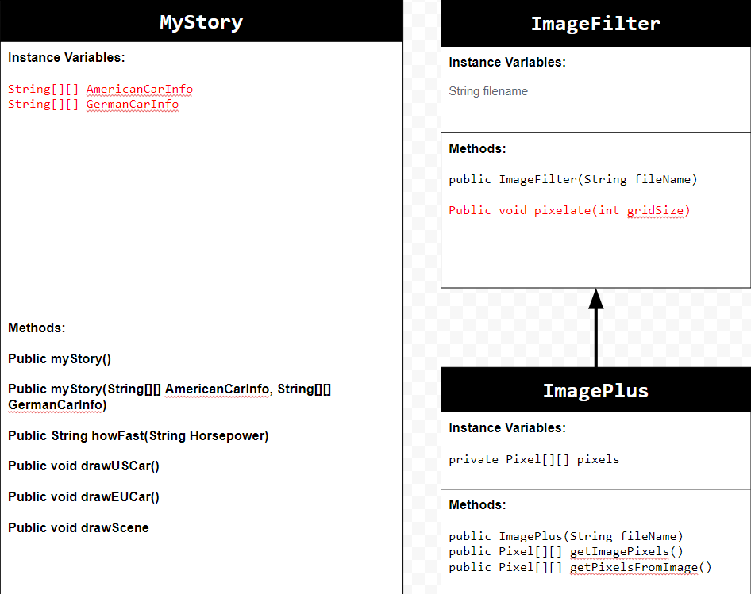

# Unit 5 - Personal Narrative

## Introduction

Images are often used to portray our personal experiences and interests. We also use image filters and effects to change or enhance the mood of an image. When combined into collages and presentations, these images tell a story about who we are and what is important to us. Your goal is to create a personal narrative using The Theater that consists of images of your personal experiences and/or interests, incorporates data related to these experiences and/or interests that can be organized in a 2D array, and uses image filters and effects to change or enhance the mood of your images.

## Requirements

Use your knowledge of object-oriented programming, two-dimensional (2D) arrays, and algorithms to create your personal narrative collage or animation:

- **Create at least two 2D arrays** – Create at least two 2D arrays to store the data that will make up your visualization.
- **Implement one or more algorithms** – Implement one or more algorithms that use loops and two-way or multi-selection statements with compound Boolean expressions to analyze the data.
- **Use Image Filters** - Include multiple image filters learned from this unit, and additionally create new ones of your own.
- **Use methods in the String class** – Use one or more methods in the String class in your program, such as to determine whether the name of an image file contains specific characters.
- **Create a visualization** – Create an image or animation that conveys the story of the data by illustrating the patterns or relationships in the data.
- **Document your code** – Use comments to explain the purpose of the methods and code segments and note any preconditions and postconditions.

## UML Diagram

Put and image of your UML Diagram here. Upload the image of your UML Diagram to your repository, then use the Markdown syntax to insert your image here. Make sure your image file name is one work, otherwise it might not properly get display on this README.

## Video

Record a short video of your story to display here on your README. You can do this by:

- Screen record your project running on Code.org.
- Upload that recording to YouTube.
- Take a thumbnail for your image.
- Upload the thumbnail image to your repo.
- Use the following markdown

<video controls src="ProjectDemo.mp4" title="Title"></video>

## Story Description

Write a description of the story that your animation showcases. Give addional context for your story here in the case your animation is more abstract and only has images and little text. Lastly, include what data in your project is represented in 2D arrays and how those directly relate to the story your animation showcase.

For this story I decided to show my favorite car from different manufacturers and different countries. I decided to showcase 6 cars, 3 from the US and 3 from Germany. I also decided for each car to be from a different brand. In the story it will show a picture of the car, and text will say its year, make and model, trim, horsepower, and how fast it is. It will then play an audio clip of the car and then pixelate the image and go on to the next car. For my data I used 2 2D String arrays, 1 for the US cars, and 1 for the German cars. In each array each car gets a dedicated row. Column 1 has the car's year, make, model, and trim. Column 2 has the horsepower as a String instead of an int. Column 3 has the filename for the image of the car as a string. Column 4 has the filename for the audio clip of the car as a String. Using arrays allows me to use a for-loop that traverses the row and gets data from the columns to produce text, images, and audio clips. This allows for extra cars to be added, or for current cars to be edited.

## Image Filter Analysis

Choose at least 2 filters uses in your animation to explain how the pixels are modified. If you created a new image filter that was not one of the ones from this unit, make sure to explain and analyze that filter(s) before choosing ones that came from this unit.

For my image filter I decided to use a pixelate filter to transition between images of cars. The pixelate filter splits the image up into regions (the new pixels) each region is square and has a side length of "X" that is defined by the user (The bigger X is the more pixelated the photos get). In each region the average RGB values of all the pixels are taken and applied to every pixel, making the region look like 1 big pixel. To do this the code traverses a 2D array containing the image pixel values, and increments by X. This way the for-loop will always traverse to the top left pixel of each region. For each traversal there is an inner traversal that traverses each individual pixel for each region. The RGB values are added up, divided by the amount of pixels in the region, and then another traversal (identical to the previous one) is used to traverse the same region and apply the same average RGB value to each pixel of the region.